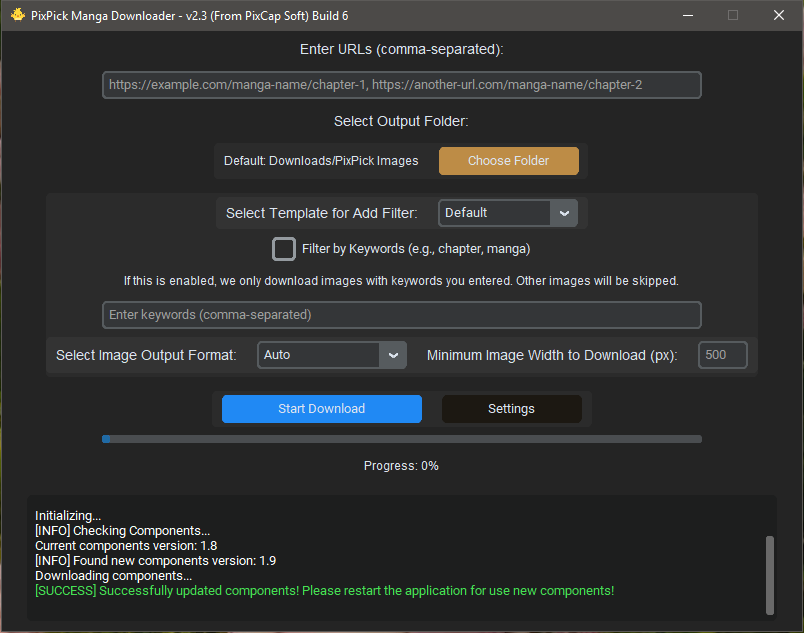
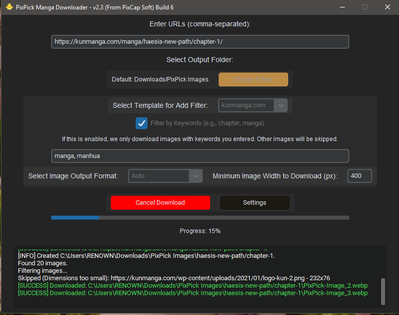

# PixPick - A GUI Manga, Manhua, Manhwa and Comic Downloader

**Click here to Download Latest Version:**

[](https://github.com/ranujasanmir/PixPick/releases/download/v2.4/PixPick.Installer.x64.bit.exe)

### Important Note

Base of this application was originally a plugin for **Animate-RX AI** and We didn't added it to the AI. And We build application with that base code. Use at your own discretion. Do not download copyrighted content with this. We discourage any illegal usage.

#### Liability and License Notice
PixPick and its maintainers cannot be held liable for misuse of this application, as stated in the [MIT license](https://github.com/ranujasanmir/PixPick/blob/main/LICENSE).
The maintainers of PixPick do not in any way condone the use of this application in practices that violate the Terms of Service of web apps that allow to read comics (From now on we represent Manga, Manhua, Manhwa and any others using comics). The maintainers of this application call upon the personal responsibility of its users to use this application in a fair way, as it is intended to be used.
##

PixPick does not require Selenium or any other browser to be interface with web pages, it does so directly using a **http requests**. 
Also some web pages blocking http requests. So you cannot download content from that sites.
 
## Please Read

This is the only official repository and is maintained by the community.
 **Contact the Main Developer [here](https://t.me/PixCap_Support)**

**_`PixPick` is a GUI software that allow users to download Manga, Manhua, Manhwa, Comics and etc for read offline._**

## Table of Contents

- [Installation](#installation)
- [Update](#update)
- [System Requirements](#system-requirements)
- [How To Use](#how-to-use)
  - [Home](#home)
  - [Features](#features)
  - [Templates](#templates)
    - [Create Your Own Templates](#create-templates)
- [Terms And Condition](#terms-and-condition)
- [License](#license)
- [About Us](#about-us)

## Installation

To download go to [release](https://github.com/ranujasanmir/PixPick/releases) and select any version that suitable for your system(Recommended to download latest version):

`PixPick` builded using Python. If you facing any error while opening it, Please install latest version of [Python](https://python.org) to fix opening errors!

You can install PixPick by opening installer and follow the instructions.

## Update

**How to Update:**

You can update PixPick by downloading and installing new version. Maybe in new versions GUI can be changed. But new versions have new features. So updating is at your own decision. Download latest application from [PixPick](https://github.com/ranujasanmir/PixPick/releases).

## System Requirements

**Following system Requirements are used to test PixPick. Keep in mind that you can run PixPick even with the lower specs than these.**

> Operating System : Windows 7(Service Pack 1), Windows 8, Windows 8.1, Windows 10 and Windows 11 x64 bit(Note: This will not run poperly on Windows 7.)
> Architecture : x64 Bit
> Memory : 2 GB
> Free Disk Space : PixPick need at least 25MB free space for applications. But for download comics you need more space
> Others : You need good internet connection

## How To Use

**How to use:**

PixCap UI (In v2.3) :




To use PixPick you must have direct URLs to the each chapters. You can download chapter by chapter or can use bulk downloader.

Paste your URL inside the textbox at top of the application. You can also add mutiple URLs to it by seperating each one by comma.

```
https://example.com/manga-name/chapter-1, https://example.com/manga-name/chapter-2, https://example.com/manga-name/chapter-3
```

Now you can select output folder. If you didn't select one, PixPick will automatically download images into the `Downloads/PixPick Images` and inside the specific folder for each manga and chapters.

Once you select the folder, you can enable filtering options. If you enable `Filter by Keywords`, PixPick will only download images with the keywords you have provided. For example:

Imagine that page has two images with following links,

```
https://example.com/wp-content/manga-images/image1.png
```
```
https://example.com/wp-content/images/logo.png
```

First link is one of image URL in manga chapter. But second one is web site logo. As you can see first link has keyword 'manga' inside it. But second image not have it. If you enable `Filter by Keywords`, and add 'manga' keywords PixPick only download images that has `manga` as a keywords.

**Keep in mind:**

Usually comic images has width more than 500 pixels in every comic sites. PixPick will automatically skipping images that has width lower than 500 pixels. In next Filtering option you can ajust the pixel limit according to the you likes. But make sure to check width and height in comic images before adding it.

Next is you can select image saving file format. If you select any of available optionPixPick will save all images in that file format.

### Features

**Easily download full chapters:**
PixPick allow you to download each chapter without Right-Click -> Save as Image in browser!

**Bulk download:**
No need to manually visit every page. Just paste all links to download seperated by comma, PixPick will download all chapters you entered!

**Filtering Options:**
PixPick give filtering options to ajust. So you don't miss any chapter images!

**Convert image format while downloading:**
PixPick allow users to select output file format.. You can automatically save them as *.jpg or *.png or *.webp while downloading! But we suggest you to set it to `Auto`

### Templates

> Templates will allow you to simply setup filtering options for specific comic pages. If you select any template available you can download comics from that site without editing filtering options.

#### Create Templates

> You can also create your own templates and submit to us. Configuration for Templates are following:

```json
{
  "name": "example.com", // Add name of the site yu creating template for.
  "keywords": ["manga"], // Add keywords. These are the links keyword in  as mentioned earliar.
  "min_width": 600 // This is the minimum width of manga image.
},
{
  "name": "example.com",
  "keywords": [], // In this site it dosen't need keywords to download manga images. Its downloading all images that width higher than min_width.
  "min_width": 600
}
```

> We are glad to host your templates on our official server. Send your templates to us: [On Telegram](https://t.me/PixCap_Support)

## Terms And Condition

1. **User Responsibly**: PixPick is developed for only personal usage. For other usage you have to ask permission from comics sites maintainers.

2. **Security**: PixPick is 100% safe. It will only connect with our server and comic sites web servers only. No your data will be collected or shared. PixPick will automatically checking update by requesting our server. 

3. **Privacy**: We didn't have privacy for PixPick for now. But you have to agree with comic sites privacy policies before download them.

## License

This project is licensed under the MIT License - see the [LICENSE](https://github.com/ranujasanmir/PixPick/LICENSE) file for details.

## About Us

We are PixCap TM. We are from Sri Lanka! We are intended to build modern day solutions for make this world better...

**Copyright © 2020-2025 PixCap TM.**
**All rights Reserved.**


